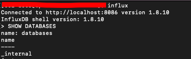
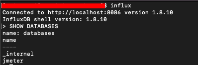

# Perform Load Test at scale using Jmeter, Docker, AWS ECS
Load Testing using Docker and AWS ECS

Our idea with this solution is to perform load test on a larger scale. This will help to understand the stress point of APIs along with improving the scalability of APIs to address high incoming traffic.

# Tech stack
1. Jmeter
2. Docker
3. AWS ECS
4. Grafana
5. InfluxDb

<b><u> Implement Load Test using Jmeter</u></b>    
For our example we are using open APIs of gorest endpoints. We are implementing below endpoints  
a) GET USERS (GET)  
b) GET POSTS (GET)  
c) CREATE USER (POST)  
d) DELETE USER (DELETE)  

* Each request is written in the form of HTTP Request sampler.  
* All the values are passed as environment variables from Env Variable step.  
* Trees, Table and Summary Report are used as Listeners to visualize the implementation results  

<b> Backend Listner is used to push the execution logs to influxDb server </b>  
<u>Note</u>: Always replace the server URL in the backend listener from Env variables step <i>"influxdbUrl"<i>  

<b><u> Set Up Grafana on AWS EC2 </u></b>  

We are using Grafana in order to visualize the execution of load test in near real time.
1. Launch an EC2 instance from your EC2 console.
2. You can assign an elastic IP if needed (optional).
3. Enable port 3000 in your security group that is attached to your EC2 instance. As Grafana listen on this port number.  
4. SSH into the launched instance.

<u>List of commands that needs to be executed after you successfully SSH into your instance</u>  
1. <b>sudo yum update -y</b> (To update packages in the newly launched instance).  
2. <b>sudo nano /etc/yum.repos.d/grafana.repo</b> (Creating repo for installing open source grafana).    
3. Add the below lines in the file created from above step 2.  
```  
[grafana]  
name=grafana  
baseurl=https://packages.grafana.com/oss/rpm  
repo_gpgcheck=1  
enabled=1  
gpgcheck=1  
gpgkey=https://packages.grafana.com/gpg.key  
sslverify=1  
sslcacert=/etc/pki/tls/certs/ca-bundle.crt  
```
4. Install grafana using the command <b>sudo yum install grafana</b>  
5. Reload the systemd to load the new settings. Start Grafana Server, then check for its status using <b>sudo systemctl daemon-reload</b>  
6. Start the grafana server by using command <b>sudo systemctl start grafana-server</b>  
7. You can check the status if grafana is running by running the command <b> sudo systemctl status grafana-server. </b>  
8. Run the command below to make sure that Grafana will start upon booting our Amazon Linux 2 instance.  
<b>sudo systemctl enable grafana-server.service</b>  
 
<b><u> Testing your grafana server </u></b>  
Visit the newly installed Grafana Server by visiting the Public IP of the EC2 Instance on port <b>3000</b>.  
If everything has been setup correctly you should be redirected to grafana dashboard login page. (Access the dashboard by <b>http://{IP_ADDRESS_OF_SERVER}:3000</b>)  


  

By default username and password will be <b>admin</b>, Once you enter the details you will be redirected to change password screen where you can enter a new password (Input the desired password except admin) and click Save.  

<b><u> Set Up InfluxDb on EC2 instance </u></b>  
1. Run the below command to create a influxdb repo.  

```
cat <<EOF | sudo tee /etc/yum.repos.d/influxdb.repo
[influxdb]
name = InfluxDB Repository - RHEL 7
baseurl = https://repos.influxdata.com/rhel/7/x86_64/stable
enabled = 1
gpgcheck = 1
gpgkey = https://repos.influxdata.com/influxdb.key
EOF
```  
2. Run <b>sudo yum repolist</b> to confirm we've the repository added to our Amazon Linux 2.  
3. Now install influxdb using the command <b>sudo yum install influxdb.</b>  
4. Start the influxdb service using <b>sudo systemctl start influxdb.</b>  
5. Set the service to be started every time the server is restarted <b>sudo systemctl enable influxdb.</b>  
6. Check the status of influxdb using <b>systemctl status influxd.</b>  

** Important Note: Allow port 8086 and 8088 on your inbound rules of security group of your EC2 instance **

<b><u> Testing of influxDB </u></b>  
Run the following command  
```
curl -G http://localhost:8086/query --data-urlencode "q=SHOW DATABASES"  
```
You should see the output as below  
```
{"results":[{"statement_id":0,"series":[{"name":"databases","columns":["name"],"values":[["_internal"]]}]}]}  
```
<b><u> Setup Database </u></b>  
We will need to create a database to store our Jmeter Results. Open InfluxDB command line interface by executing command “influx” in terminal.  
* Run ‘<b>SHOW DATABASES</b>’ command, you can see the list of all existing InfluxDB dabasebases. If you have just installed InfluxDB you should see only one ‘_internal’ database, which is used for keeping different stats about database itself:  

 

* Run the command: “<b>CREATE DATABASE jmeter</b>” — here “jmeter” is the database name.  



<b><u>Configure InfluxDb</b></u>  
* Once we have created a database for our metrics, we need to make a few changes to the InfluxDB configuration. Use below command to open your influxdb.conf file  
```
sudo vim /etc/influxdb/influxdb.conf
```  
In this configuration file you need to find, uncomment and edit the ‘[[graphite]]’ category appropriately:
```
[[graphite]]  
# Determines whether the graphite endpoint is enabled.  
enabled = true  
database = "jmeter"  
retention-policy = ""  
bind-address = ":2003"  
protocol = "tcp"  
consistency-level = "one"  
batch-size = 5000  
batch-pending = 10  
batch-timeout = "1s"  
udp-read-buffer = 0  
separator = "."  
```  
* After that you need to restart InfluxDB by applying an edited configuration:  
``` 
influxd -config /etc/influxdb/influxdb.conf
```  
